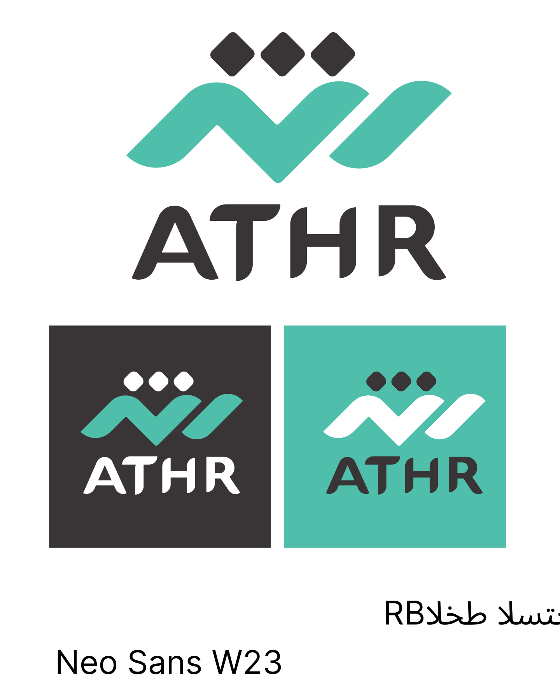

# Al Baker Air Conditioning

<div align="center">



[](https://flutter.dev/)
[](https://dart.dev/)
[](LICENSE)
[](https://albakr-ac.com/api)

</div>

## 📱 Overview

Al Baker Air Conditioning is a mobile application designed to streamline the process of purchasing, maintaining, and servicing air conditioning units. The app serves as a comprehensive platform connecting customers with Al Baker's air conditioning services, offering a seamless experience for both customers and technicians.

## ✨ Key Features

### Customer Features
- **Product Browsing & Purchase**
  - Browse complete AC catalog
  - View detailed product specifications
  - Add items to cart
  - Secure checkout process
  - PyMob payment integration

- **Service Management**
  - Schedule maintenance appointments
  - Track service requests
  - View service history
  - Get price quotes

- **User Experience**
  - Personalized user profiles
  - Favorite products list
  - Order tracking
  - Push notifications
  - Arabic language support

## 🛠️ Technologies & Tools

### Core
- **Flutter** (v3.7.2)
- **Dart** (v3.7.2)
- **Android NDK** (v27.0.12077973)

### Frontend
- **Lottie** (^3.3.1) - For smooth animations
- **RFlutter Alert** (^2.0.7) - Custom alert dialogs
- **Cupertino Icons** (^1.0.8) - iOS-style icons

### Networking & Data
- **Dio** (^5.8.0+1) - HTTP client
- **Shared Preferences** (^2.0.15) - Local storage
- **Cached Network Image** (^3.3.0) - Image caching
- **URL Launcher** (^6.2.4) - External URL handling

## 🏗️ Architecture

The project follows a service-based architecture, organized into modular services for better maintainability and scalability.

### Services
- **Authentication Service** - User authentication and authorization
- **Cart Service** - Shopping cart management
- **Orders Service** - Order processing and tracking
- **Products Service** - Product catalog management
- **User Service** - User profile management
- **Works Service** - Service requests handling
- **Payment Service** - PyMob payment integration
- **Home Service** - Home screen data management
- **Favorite Service** - Wishlist management
- **Ask Price Service** - Price quote requests

## 📂 Project Structure

```
al_baker_air_conditioning/
├── assets/
│   ├── animations/            # Lottie animation files
│   ├── fonts/                 # Custom fonts (e.g., Almarai)
│   ├── icons/                 # App icons
│   └── images/                # Static images used in UI
│
├── lib/
│   ├── generated/             # Auto-generated localization or config files
│   ├── screens/               # All app screens
│   │   ├── app_screens/           # Main app screens (home, product, cart, etc.)
│   │   ├── authorization_screens/ # Login, register, OTP verification
│   │   └── splash_screen.dart     # Initial splash screen
│   │
│   ├── services/              # Logic layer (API, data handling)
│   │   ├── ask_price_service.dart
│   │   ├── cart_service.dart
│   │   ├── favorite_service.dart
│   │   ├── home_service.dart
│   │   ├── orders_service.dart
│   │   ├── payment_service.dart
│   │   ├── products_service.dart
│   │   ├── projects_service.dart
│   │   ├── user_service.dart
│   │   └── works_service.dart
│   │
│   ├── utils/                 # Utility and helper functions
│   │   └── alert_utils.dart
│   │
│   ├── widgets/               # Reusable UI components
│   │   ├── custom_email_field.dart
│   │   ├── custom_navbar.dart
│   │   ├── custom_password_field.dart
│   │   └── custom_rectangle.dart
│   │
│   └── main.dart              # Application entry point
│
└── pubspec.yaml               # Flutter configuration and dependencies
```

## 🎨 UI/UX Features

- **Custom Theme** - Consistent branding with primary color #1D75B1
- **Almarai Font** - Arabic-friendly typography throughout the app
- **Responsive Design** - Adapts to different screen sizes
- **Image Caching** - Smooth loading experience with cached images
- **Custom Animations** - Enhanced user experience with Lottie animations
- **Intuitive Navigation** - Custom navigation bar for easy access to all features

## 🔒 Security Features

- **Token-based Authentication** - Secure API access with JWT tokens
- **Secure Storage** - Protected user credentials with SharedPreferences
- **Password Validation** - Ensures strong password creation
- **Secure Checkout** - Protected payment processing

## 🛠️ Setup & Installation

1. Clone the repository:
   ```bash
   git clone https://github.com/yourusername/al_baker_air_conditioning.git
   cd al_baker_air_conditioning
   ```

2. Get dependencies:
   ```bash
   flutter pub get
   ```

3. Run the app:
   ```bash
   flutter run
   ```

4. Configure the backend base URL in `services/user_service.dart` and others as needed.

## 🔧 Configuration

The app connects to the Al Baker API at `https://albakr-ac.com/api`. To modify the API endpoint:

1. Update the `baseUrl` variable in each service file under `lib/services/`
2. Rebuild the app with `flutter run`

## 👥 Roles

- **User:** Browse products, ask for price, order, manage cart and favorites.

## 📱 Platform Support

- **Android:** API 21+ (Android 5.0 Lollipop and above)
- **iOS:** iOS 11.0 and above
- **Web:** Modern browsers (Chrome, Firefox, Safari)

## 📬 Contact

For inquiries, support, or collaboration:

- 📧 Email: [elbakr@example.com](mailto:elbakr@example.com)
- 🌐 Website: [https://elbakerair.com](https://elbakerair.com)

## 📄 License

This project is licensed under the MIT License. See the `LICENSE` file for details.